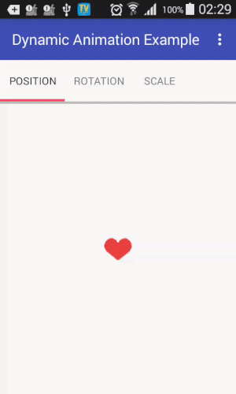

# Dynamic Animation Example

[](https://www.apache.org/licenses/LICENSE-2.0)
[](https://android-arsenal.com/api?level=16)

### 
[Dynamic-animation](https://developer.android.com/reference/android/support/animation/package-summary.html) is a new module introduced in [revision 25.3.0 of the Android Support Library](https://developer.android.com/topic/libraries/support-library/revisions.html#25-3-0). It provides a small set of classes for making realistic physics-based view animations.


### Setup
To get started, add the following dependency to your module’s build.gradle:

```gradle 
dependencies {
    compile 'com.android.support:support-dynamic-animation:25.3.0'
}
```
**support-dynamic-animation:25.3.0** new physics-based animation library that provides a set of APIs for building animations that dynamically react to user input
 
### Making a SpringAnimation
Well, it won’t really be generic in a programming sense, but let’s start with how every SpringAnimation is made.

1. Create a SpringAnimation object for your View with a specified ViewProperty
2. Create a SpringForce object and set your desired parameters (which are described above).
3. Apply the created SpringForce to your SpringAnimation.
4. Start the animation.

```java 
 private void startSpringAnimation(View view){
        // create an animation for your view and set the property you want to animate
        SpringAnimation animation = new SpringAnimation(view, SpringAnimation.X);
        // create a spring with desired parameters
        SpringForce spring = new SpringForce();
        // can also be passed directly in the constructor
        spring.setFinalPosition(100f);
        // optional, default is STIFFNESS_MEDIUM
        spring.setStiffness(SpringForce.STIFFNESS_LOW); 
        // optional, default is DAMPING_RATIO_MEDIUM_BOUNCY
        spring.setDampingRatio(SpringForce.DAMPING_RATIO_HIGH_BOUNCY);
        // set your animation's spring
        animation.setSpring(spring);
        // animate!
        animation.start();
    }
```
    
### Examples


### Position
Let’s say we have an arbitrary view positioned in the center of the screen
We want to achieve the following behavior:

1. Drag the view.
2. Move it around.
3. Release it.
4. The view springs back to its original position.

### Rotation
There’s a rotating view on our screen which behaves like this:

1. Grab the view.
2. Spin it.
3. Release it.
4. The view spins back to its original position, again with a bounce.

### Scale
As usual, there’s a view on our screen (it could be a photo) which has the following behavior:

1. Grab it with 2 fingers.
2. Do a typical pinching gesture to zoom in or out.
3. Release it.
4. The view scales back to its original size.

Enjoy!

Developed By
-------
Igor Havrylyuk (Graviton57)

[1]: https://github.com/graviton57/DynamicAnimationExample.git
